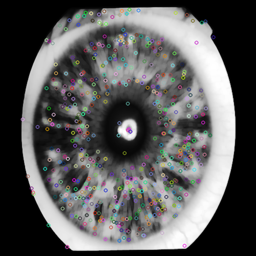

# Iris Biometric System

This project aims to develop a biometric system for individual identification using iris recognition. The system allows users to input an iris image through a graphical interface and display the identity of the identified person from the database after processing steps.


## Features
- Extracts iris images from the Iris Database (upol.cz), consisting of 3 x 128 iris images (i.e., 3 x 64 left and 3 x 64 right).
- Utilizes the Scale Invariant Feature Transform (SIFT) method for feature extraction.
- Matches iris images using Euclidean distance.
- Provides a graphical user interface for user interaction.

## Installation

### Prerequisites
- Python 3.x installed
- Pip package manager installed

### Installation Steps
1. Clone the repository:
   ```bash
   git clone https://github.com/OUARAS-khelil-Rafik/iris_biometric_system.git

2. Navigate to the project directory:
   ```bash
   cd iris_biometric_system

3. Install dependencies:
   ```bash
   pip install -r requirements.txt

4. Run the application:
   ```bash
   python src/main.py

## Usage
- Launch the application using python src/main.py.
- Upload an iris image using the "Upload Iris" button.
- Follow the on-screen instructions to view the matching result.

## Contributors
Khelil Rafik OUARAS (@OUARAS-khelil-Rafik)

## environment.txt
- pip=24.0
- python=3.12.2
- sqlite3=3.43.1
- tkinter=8.6
- PIL=10.2.0

## requirements.txt
- numpy==1.26.3
- opencv-python==4.9.0.80
- imageio==2.34.0
- Pillow==10.3.0
- tk==0.1.0
- matplotlib==3.8.3

## Screenshots
### UPLOAD File


### Detected SIFT Image 01 et 02 (Exemple)
 

### Matching rate results


### Matching Results (Image Match)


### If not matching 'Unknown Person'


The verification process involves using BFMatcher "Distance euclidienne" image matching library. The image of the user's IRIS captured live during the verification screening is fed through the method match_images(), along with the registered captured IRIS with the ID the user inputted. If there is a match using BFMatcher "brute force matching", the user input information will be displayed in a dialog box (new frame). The match_rate conditional statement will have to be adjusted based on what video capture system is used. For stronger cameras, a match rate greater then 50% will work. For weaker camera devices such as a wireless webcam, a lower value such as 35% should be considered.

<div style="display: flex; justify-content: center;">
    
</div>

<div style="display: flex; justify-content: center;">

</div>
