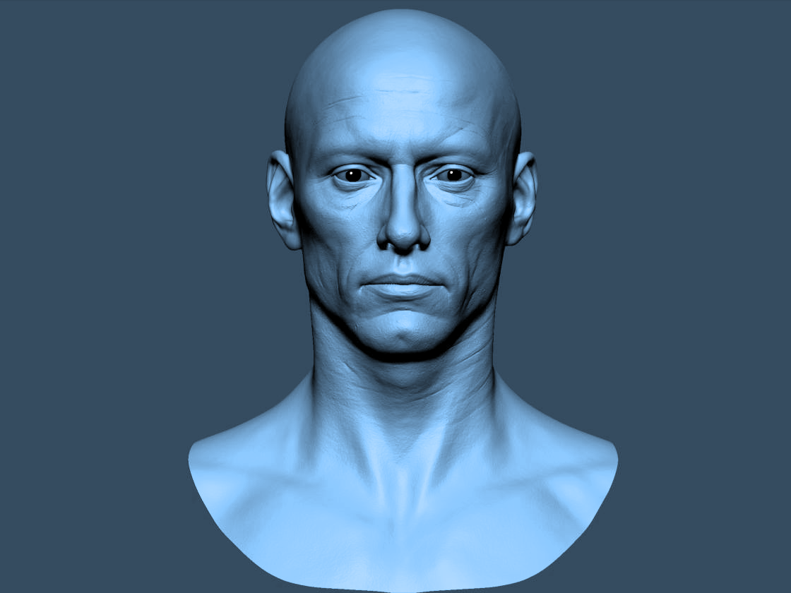

# Iris Biometric System

This project aims to develop a biometric system for individual identification using iris recognition. The system allows users to input an iris image through a graphical interface and display the identity of the identified person from the database after processing steps.



## Features
- Extracts iris images from the Iris Database (upol.cz), consisting of 3 x 128 iris images (i.e., 3 x 64 left and 3 x 64 right).
- Utilizes the Scale Invariant Feature Transform (SIFT) method for feature extraction.
- Matches iris images using Euclidean distance.
- Provides a graphical user interface for user interaction.

## Installation

### Prerequisites
- Python 3.x installed
- Pip package manager installed

### Installation Steps
1. Clone the repository:
   ```bash
   git clone https://github.com/OUARAS-khelil-Rafik/iris_biometric_system.git

2. Navigate to the project directory:
   ```bash
   cd iris_biometric_system

3. Install dependencies:
   ```bash
   pip install -r requirements.txt

4. Run the application:
   ```bash
   python src/main.py

## Usage
- Launch the application using python src/main.py.
- Upload an iris image using the "Upload Iris" button.
- Follow the on-screen instructions to view the matching result.

## Contributors
Khelil Rafik OUARAS (@OUARAS-khelil-Rafik)

## environment.txt
- pip=24.0
- python=3.12.2
- sqlite3=3.43.1
- tkinter=8.6
- PIL=10.2.0

## requirements.txt
- numpy==1.26.3
- opencv-python==4.9.0.80
- imageio==2.34.0
- Pillow==10.2.0
- tk==0.1.0
- matplotlib==3.8.3
